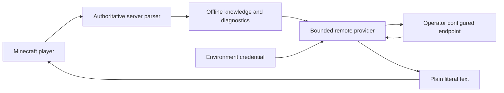

# Shadow remote dialogue threat model

## Executive summary

Shadow and First Vessel dialogue can optionally cross a server-to-provider HTTPS boundary. The primary risks are credential disclosure, prompt-context disclosure, malicious response presentation, and remote-service denial of service. Gameplay authority remains local: the provider returns bounded prose only, and no response enters the command, item, recipe, target, permission, or casting paths. The feature is disabled by default and always has an offline answer.

## Scope and assumptions

- In scope: `BoundedDialogueProvider`, `BoundedKnowledgeProvider`, `JdkDialogueTransport`, their runtimes/configuration, `KnowledgeQuery`, and final chat presentation.
- Out of scope: the operator's provider implementation, hosting account, TLS termination, and general Minecraft/Fabric security.
- Assumption: a trusted server operator chooses the endpoint and environment-variable name; ordinary players cannot edit the server config or environment.
- Assumption: this is a private/self-hosted multiplayer server. The endpoint may be Internet-hosted, but no inbound POWERS network service is created.
- Assumption: remote prose is untrusted even when the configured provider is reputable.
- Open question: an operator using a shared proxy must independently verify its retention and access policies. This does not change the local no-authority boundary.

## System model

### Primary components

- Minecraft players submit bounded `shadow, ...` questions; local parsing and server validation own every action.
- `KnowledgeService` resolves authoritative diagnostics, recipes, registries, and curated lore locally before remote fallback is considered.
- The two bounded providers own eligibility, cooldown, concurrency, timeout, endpoint validation, and response sanitization.
- `JdkDialogueTransport` sends an OpenAI-compatible JSON request on a bounded daemon executor and reads at most 8 KiB.
- `ShadowCompanionMessaging` and `FirstVessel` render the returned string as a literal component; they do not parse it as a command.

### Data flows and trust boundaries

- Player → server parser: chat text over the normal authenticated Minecraft session; maximum query and parser bounds apply; the server independently authorizes actions.
- Server → optional provider: redacted prompt plus registry identifiers over HTTPS, or plain HTTP only to loopback; bearer credential comes from the configured environment variable; per-owner cooldown, global concurrency, and 2.5-second maximum timeout apply.
- Provider → server: untrusted JSON, HTTP 2xx only, 8-KiB body limit; JSON shape validation, plain-text sanitization, 256/1,024-character output bounds, and offline fallback apply.
- Server → players: a literal chat/overlay component; visibility follows Shadow's server-owned hidden/revealed recipient rules.

#### Diagram

## Assets and security objectives

| Asset | Why it matters | Security objective |
| --- | --- | --- |
| Provider credential | Authorizes billable/provider access | Confidentiality, integrity |
| Gameplay authority | Commands, items, permissions, casts, and recipes must stay server-owned | Integrity |
| Player/world privacy | Chat identity and exact world state must not be exported | Confidentiality |
| Server tick availability | A provider must not block or exhaust the tick thread | Availability |
| Dialogue integrity | Remote text must not impersonate operators or forge formatting | Integrity |

## Attacker model

### Capabilities

- An ordinary player can submit adversarial, Unicode, or prompt-injection-style questions at the normal chat boundary.
- A remote endpoint, network peer after an operator configuration error, or compromised provider can return malformed, oversized, misleading, formatted, or bidi-controlled content and can delay/fail requests.
- A malicious player can repeatedly request eligible low-confidence answers within rate limits.

### Non-capabilities

- Players cannot select the endpoint, model, environment variable, or credential under the deployment assumption.
- Remote output has no call site that invokes commands, selects targets, grants items, defines recipes, or changes casting state.
- The provider does not receive player UUID/name, IP, chat history, or exact coordinates from `KnowledgeQuery`/`LoreDialogueContext`.

## Entry points and attack surfaces

| Surface | How reached | Trust boundary | Notes | Evidence |
| --- | --- | --- | --- | --- |
| Shadow question | `shadow, ...` chat | Player → server | Bounded question and local authoritative resolution | `KnowledgeQuery`; `KnowledgeService.answerAsync` |
| Dialogue config | Server JSON/environment | Operator → runtime | Disabled by default; credential value is not stored in config | `PowersConfig.DialogueProvider`; `DialogueProviderRuntime.current` |
| HTTP endpoint | Asynchronous POST | Server → provider | HTTPS or loopback HTTP; timeout and executor limits | `BoundedDialogueProvider.endpoint`; `JdkDialogueTransport.request` |
| Response JSON | Provider response body | Provider → server | 8-KiB body, expected JSON path, fallback on error | `JdkDialogueTransport.boundedBody`; both bounded providers |
| Chat presentation | Completed future | Server → recipients | `Component.literal`; server re-enters its executor | `ShadowCompanionMessaging.sendReply`; `FirstVessel.sendLoreIfRelevant` |

## Top abuse paths

1. Player embeds instructions in a question → provider follows them → response requests a privileged action → response is sanitized and displayed only as literal prose; no action executor consumes it.
2. Provider returns colour codes, bidi overrides, fake `<Operator>` prefixes, and newlines → `DialogueTextSanitizer` removes those controls/prefix delimiters and collapses output to one line.
3. Provider streams an unbounded body → transport stops after 8,193 bytes and rejects bodies above 8 KiB.
4. Players flood remote questions → per-owner cooldown, one request per owner, four-request global maximum, short timeout, and offline fallback bound work.
5. Endpoint stalls → HTTP request times out off-thread; gameplay immediately retains an offline result and the tick thread is never blocked.
6. Operator accidentally uses an insecure public URL → endpoint policy refuses non-loopback HTTP and uses the offline fallback.
7. Provider invents a recipe or contradicts a failed-cast cause → recipe questions cannot use remote fallback; authoritative diagnostics are prepended verbatim and remain server-derived.

## Threat model table

| Threat ID | Threat source | Prerequisites | Threat action | Impact | Impacted assets | Existing controls | Gaps | Recommended mitigations | Detection ideas | Likelihood | Impact severity | Priority |
| --- | --- | --- | --- | --- | --- | --- | --- | --- | --- | --- | --- | --- |
| TM-001 | Compromised provider | Feature enabled | Return deceptive/control-rich text | Chat impersonation | Dialogue integrity | Literal components; `DialogueTextSanitizer`; bounded output | Provider prose can still be socially misleading | Keep opt-in; label remote confidence/source in diagnostics | Count rejected/sanitized responses without storing text | medium | medium | medium |
| TM-002 | Player | Eligible remote query | Prompt-inject provider toward gameplay instructions | Misleading advice | Gameplay authority | Local task parser and validation; no response-to-action path; recipe fallback denied | Natural-language advice is not semantically verified | Never add tool calling; retain offline diagnostic precedence | Metric for remote fallback and local override | medium | low | low |
| TM-003 | Provider/network | Enabled endpoint | Delay, fail, or flood response | Thread/connection pressure | Availability | 2.5-second cap, 1–4 daemon threads, owner/global limits, offline fallback | Operator may choose an unreliable endpoint | Expose timeout/rejection counters in diagnose | Alert on sustained failure ratio | medium | low | low |
| TM-004 | Config reader/host compromise | Host access | Read environment credential | Provider-account abuse | Credential | Value loaded only from environment and never placed in prompts/logs | Host-level compromise remains authoritative | Use scoped/rotatable key and provider spending limits | Provider-side usage alerts and key rotation | low | high | medium |
| TM-005 | Misconfigured operator | Config access | Select privacy-hostile provider | Retention of redacted prompts | Player/world privacy | Restricted context fields; disabled default | Provider retention is outside mod control | Document provider review; prefer local endpoint | Provider audit logs and retention policy | low | medium | low |
| TM-006 | Malicious endpoint | Operator selected endpoint | Malformed/oversized JSON | Parser or memory pressure | Availability | 8-KiB hard limit, shape checks, exception fallback | JSON is still parsed in memory after bounded read | Retain limit and dependency updates | Count malformed bodies/statuses | low | low | low |

## Criticality calibration

- Critical: remote prose executing server commands or granting arbitrary items; disclosure of the credential to ordinary players. Neither path exists in the reviewed design.
- High: provider control causing persistent gameplay-state corruption; unbounded synchronous network work freezing the server. The reviewed paths are local-authority and asynchronous.
- Medium: provider credential loss at host scope; convincing operator/player impersonation; sustained bounded availability degradation.
- Low: occasional remote timeout, rejected malformed response, or misleading prose that cannot cross the gameplay authority boundary.

## Focus paths for security review

| Path | Why it matters | Related threats |
| --- | --- | --- |
| `src/main/java/com/powers/companion/BoundedDialogueProvider.java` | Endpoint and prose-output boundary | TM-001, TM-003, TM-005 |
| `src/main/java/com/powers/knowledge/BoundedKnowledgeProvider.java` | Diagnostic/recipe authority separation | TM-001, TM-002, TM-006 |
| `src/main/java/com/powers/companion/JdkDialogueTransport.java` | Credential-bearing HTTP and response-size limit | TM-003, TM-004, TM-006 |
| `src/main/java/com/powers/companion/DialogueTextSanitizer.java` | Untrusted presentation normalization | TM-001 |
| `src/main/java/com/powers/config/PowersConfig.java` | Opt-in configuration bounds | TM-003, TM-004, TM-005 |
| `src/main/java/com/powers/companion/ShadowCompanionMessaging.java` | Final literal rendering and recipient scope | TM-001, TM-002 |

## Quality check

- Player input, operator configuration, outbound HTTP, inbound JSON, credentials, and final presentation are covered.
- Every identified trust boundary appears in at least one abuse path and table row.
- Runtime controls are separated from tests/build tooling.
- Deployment assumptions are explicit; the operator was unavailable and had already authorized autonomous best-effort decisions.
- Residual provider-retention and host-credential risks remain operator responsibilities; no remote gameplay authority is accepted.
